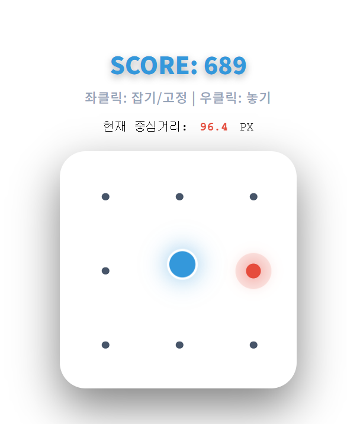

## install
pip install git+https://github.com/qqqqaqaqaqq/mouseMacroLibrary.git

## uninstall
pip uninstall QMacroDetector

---

# 0.2.1 update
안정화

## Class
Pattern_Game : 보안용 마우스 좌표 측정 매크로 탐지


--- 

## python
```
from QMacroDetector import Pattern_Game, MousePoint
from QMacroDetector.Response import ResponseBody
import dataclasses

def get_mouse_pointer(data: List[MousePoint]):
    result:ResponseBody = Pattern_Game().get_macro_result(data)

    received_data = result.data
    
    print(received_data)
```

#